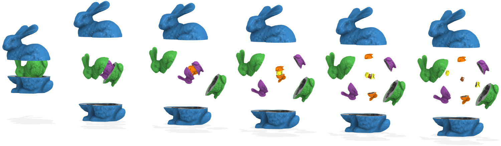
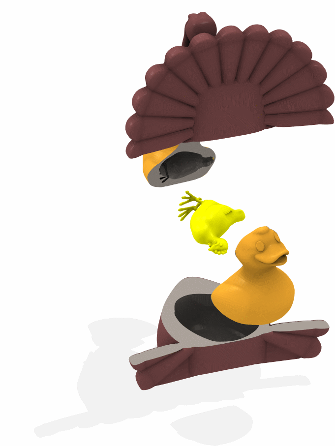

title: Generalized Matryoshka: Computational Design of Nesting Objects
author: Alec Jacobson
html header: <meta property="og:image" content="http://www.dgp.toronto.edu/projects/matryoshka/matryoshka-teaser.jpg" />
<meta property="og:description" content="This paper generalizes the
self-similar nesting of Matryoshka dolls (&quot;Russian nesting dolls&quot;) to
arbitrary solid objects. We introduce the problem of finding the largest scale
replica of an object that nests inside itself. Not only should the nesting
object fit inside the larger copy without interpenetration, but also it should
be possible to cut the larger copy in two and remove the smaller object without
collisions. We present a GPU-accelerated evaluation of nesting feasibility.
This test can be conducted at interactive rates, providing feedback during
manual design. Further, we may optimize for some or all of the nesting degrees
of freedom (e.g., rigid motion of smaller object, cut orientation) to maximize
the smaller object's scale while maintaining a feasible nesting. Our
formulation and tools robustly handle imperfect geometric representations and
generalize to the nesting of dissimilar objects in one another. We explore a
variety of applications to aesthetic and functional shape design.
" />
css: style.css

# Generalized Matryoshka: Computational Design of Nesting Objects _SGP 2017_

<div class=authors>

Alec Jacobson

University of Toronto

</div>



## Abstract

This paper generalizes the self-similar nesting of _Matryoshka_ dolls ("Russian
nesting dolls") to arbitrary solid objects. We introduce the problem of finding
the largest scale replica of an object that _nests_ inside itself. Not only
should the nesting object fit inside the larger copy without interpenetration,
but also it should be possible to cut the larger copy in two and remove the
smaller object without collisions. We present a GPU-accelerated evaluation of
nesting feasibility. This test can be conducted at interactive rates, providing
feedback during manual design. Further, we may optimize for some or all of the
nesting degrees of freedom (e.g., rigid motion of smaller object, cut
orientation) to maximize the smaller object's scale while maintaining a
feasible nesting. Our formulation and tools robustly handle imperfect geometric
representations and generalize to the nesting of dissimilar objects in one
another. We explore a variety of applications to aesthetic and functional shape
design.

## Downloads

 - [Paper](generalized-matryoshka-computational-design-of-nesting-objects-sgp-2017-jacobson.pdf )
 - [Paper (low res)](generalized-matryoshka-computational-design-of-nesting-objects-sgp-2017-compressed-jacobson.pdf)
 - [Slides](generalized-matryoshka-computational-design-of-nesting-objects-sgp-2017-slides-jacobson.pdf )
 - [Slides (low res)](generalized-matryoshka-computational-design-of-nesting-objects-sgp-2017-slides-compressed-jacobson.pdf)

## Animations





## BibTeX

```
@article{Jacobson:GM:2017,
  title = {Generalized Matryoshka: Computational Design of Nesting Objects},
  author = {Alec Jacobson},
  year = {2017},
  journal = {Computer Graphics Forum}, 
}
```

<blockquote class="twitter-tweet" data-lang="en"><p lang="en" dir="ltr"><a href="https://twitter.com/_AlecJacobson">@_AlecJacobson</a> explains how to put things inside other things. <a href="https://t.co/N6itBeT8Bs">https://t.co/N6itBeT8Bs</a> <a href="https://t.co/R1RjIdj9HY">pic.twitter.com/R1RjIdj9HY</a></p>&mdash; SGP (@GeometryProcess) <a href="https://twitter.com/GeometryProcess/status/881925319871090689">July 3, 2017</a></blockquote> <script async src="http://platform.twitter.com/widgets.js" charset="utf-8"></script>

## Acknowledgements 

This work is funded in part by NSERC Discovery Grants (RGPIN-2017-05235 &
RGPAS-2017-507938), the Connaught Fund (NR-2016-17), and a gift by Adobe
Systems Inc. Thank you to David Levin for illuminating discussions and Kevin
Gibson, Masha Shugrina, Michael Tao, and Alex Tessier for early draft reviews.
